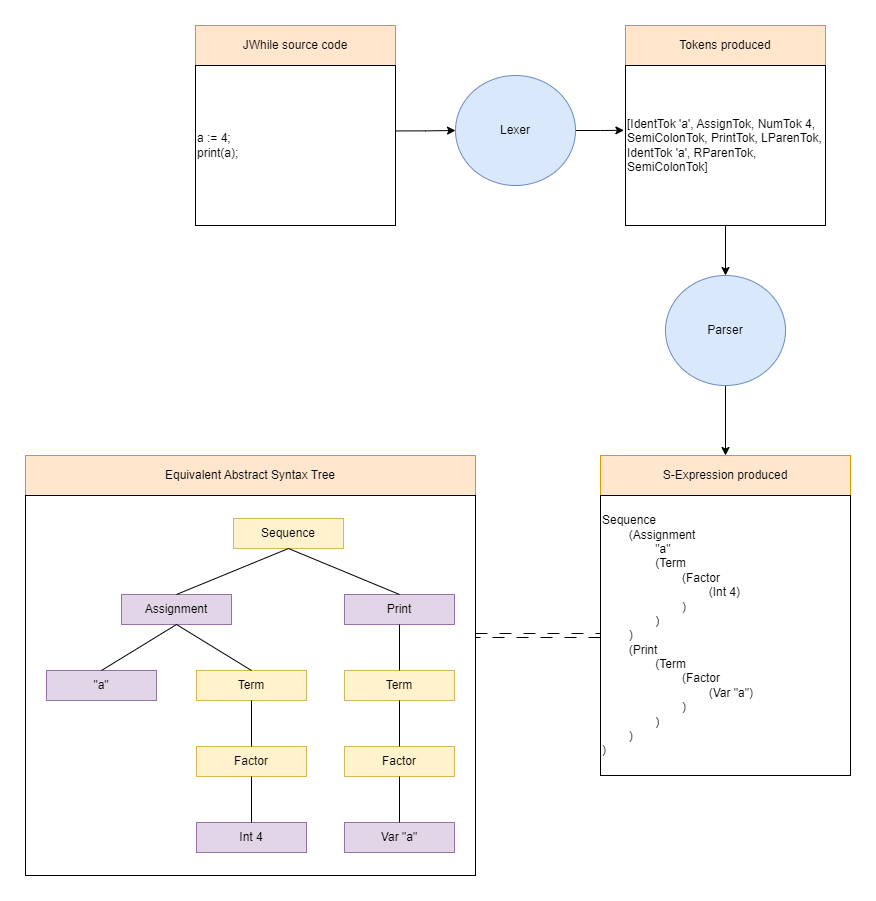

# Final-year-project
My final year project, where I designed and simulated an 8-bit CPU, with an assembler and compiler.

The below excerpts are taken from my report.

## Abstract
A central processing unit (CPU) is the heart of a computer, it allows all the other components
to function in unison to execute a program in memory. CPU’s have been rapidly improving for
the last several decades due to breakthroughs in technology, but with this they have become
complicated. Keeping this in mind, I aim to design an entire toolchain, from the compiler to
the CPU with enough functionality that it can run interesting programs, but also keep it simple
enough that it is reasonable for a single person to understand the entire process.
In this project I have designed an 8 bit central processing unit (CPU), with all the functionality
that is required to be considered Turing complete. It features an 8 bit data word, with a 16 bit
address space. Alongside the CPU, I have also designed and implemented a toolchain to compile
a high-level language I designed, called JWhile, this includes a compiler which takes a JWhile
source program, and compiles it into my assembly language, which can be ran with my assembler
that translates the assembly code into the machine code of the system, with common features
such as mnemonics and labels.

## CPU
The original SAP-1 is an interesting project and a great resource for learning the basics of
the functionality of a CPU, however it is not very useful. There are no jump instructions, you
cannot load immediate values, you cannot store values back into the memory, etc, all of which
are useful features to have when writing a program. I aim to implement these features to produce
the ability to create interesting programs, as well as to allow user input, and interesting output.
Each component of the CPU itself uses building blocks to achieve its functionality. These
building blocks are built into the Digital software purely for convenience for the end user, it is
possible to reproduce the functionality of these building blocks from simple logic gates such as
AND, OR, and NOT, or using off the shelf IC chips such as Malvino proposed (Lee, 2007).

## Assembler
An assembler is a piece of software that translates assembly code to the machine language of a
system. It is used because writing machine language programs can be tedious, and error prone.
One of the biggest problems with writing machine language programs is keeping track of jump
27 4.2 Assembly Grammar
destinations, if code is inserted, or deleted, from before a jump instruction, the jump destination
has to be updated for the new destination. When the code gets suitable large keeping track
of what addresses need to be updated can quickly lead to hard to track down bugs. Assembly
languages use labels to solve this issue, where a label is not strictly translated into machine
language instructions, but instead is turned into a memory address by the assembler (Leventhal,
1979), so the programmer does not need to be concerned with the address of the jump destination,
but rather only the location within the code.

## Compiler
An assembly language is one where the instructions match one-to-one with the generated assembly.
A high level language is one where this is not the case. There is generally a pattern to
the source code, and the generated assembly, however there is not such a strict correspondence
with each other.
High level languages are generally easier to write programs in, and it is easier to understand
the semantics of a problem being solved by a program by reading the high level source code, as
opposed to reading the equivalent program in assembly.
There are many different paradigms of high level languages, depending on the paradigm, a
program that solves the same problem can look very different. C-style languages are typically
imperative languages, where a program is a series of commands. While there are languages
that adhere to the functional paradigm, where a program is based on applying and composing
functions, typically “pure" functions (where the function does not have any side effects). It is
also important to note that a language can have many paradigms built into it, for example Java
is mainly an OOP (Object Orientated Programming) language, however it is possible to write
functional style programs in it, and is also an imperative language.
The high-level language is called JWhile, and is based on the imperative paradigm, mainly
inspired by C. This means it has the typical control flow statements, such as ‘while’, ‘if’, etc, and
uses curly braces to indicate scope and blocks. The only datatype in my language are unsigned
integers, however one-dimensional arrays can also be defined.

